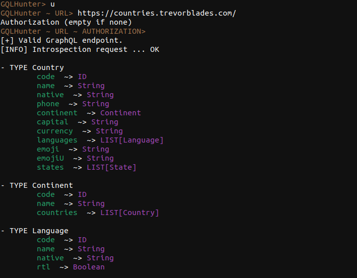
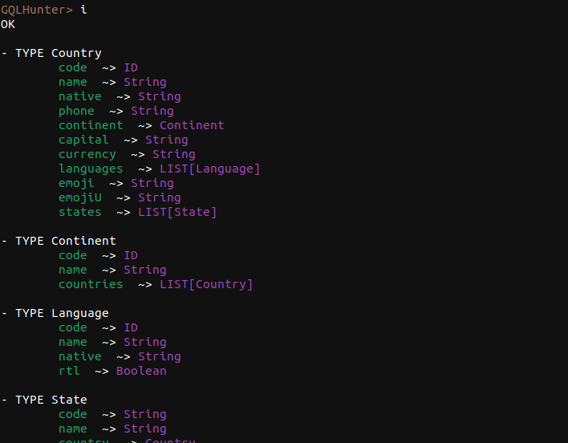
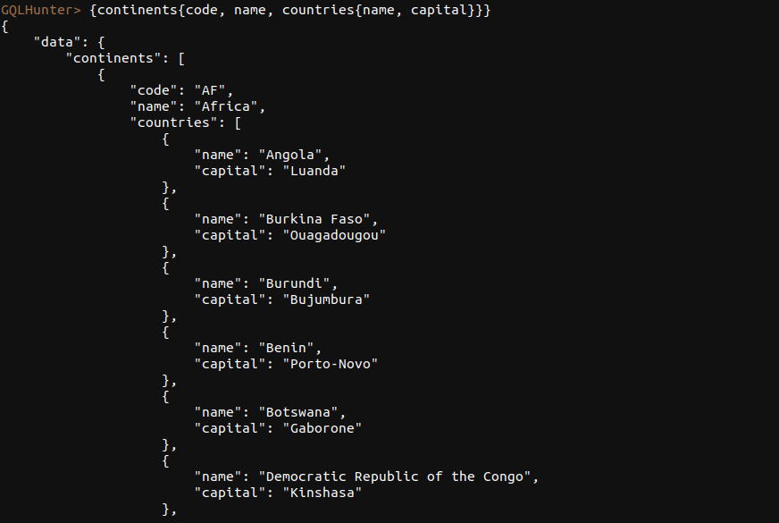

# GraphQLHunter

[](https://www.python.org/) [](https://opensource.org/licenses/MIT) 

GraphQLHunter is a interactive python tool that allows you to find and test GraphQL endpoints, perform introspection, and execute queries.

## Features

- Bruteforce directory to find GraphQL endpoint
- Test an user-specified URL to check if it is a valid GraphQL endpoint
- Perform introspection on a valid GraphQL endpoint to see all available types and fields
- Execute a specified query on a valid GraphQL endpoint


## Installation

Make sure you have [Python 3.x](https://www.python.org/downloads/) installed on your computer
Download or clone the project repository using git command: 

```
git clone https://github.com/coutand-bastien/graphQLHunter.git
```

Navigate to the project directory:

```
cd graphQLHunter
```

Install the required dependencies using pip:

```
pip3 install -r requirements.txt
```

## Usage

```
python3 GraphQLHunter.py
```

## Options

- `h`, `help`: Show help message and exit
- `bf`, `bruteforce`: Bruteforce a base URL to find the GraphQL endpoint
- `u`, `url`: Test a userspecified URL
- `i`, `intro`: Perform introspection on the endpoint
- `<query>`: Execute a specified query on the endpoint
- `exit`: Exit the program

## Commands examples

Bruteforce a base URL and find the GraphQL endpoint:


Test a user-specified URL:



Perform introspection on the endpoint:



Execute a specified query on the endpoint:



<br>


# 🚀 In the futur
- [ ] Visualisation with graphQLVoyager
- [ ] Injection back-end

<br>

# Crédits

- [SecLists](https://github.com/danielmiessler/SecLists) - GraphQL endpoints wordlists

<br>

# License

This project is licensed under the [MIT license](LICENSE).